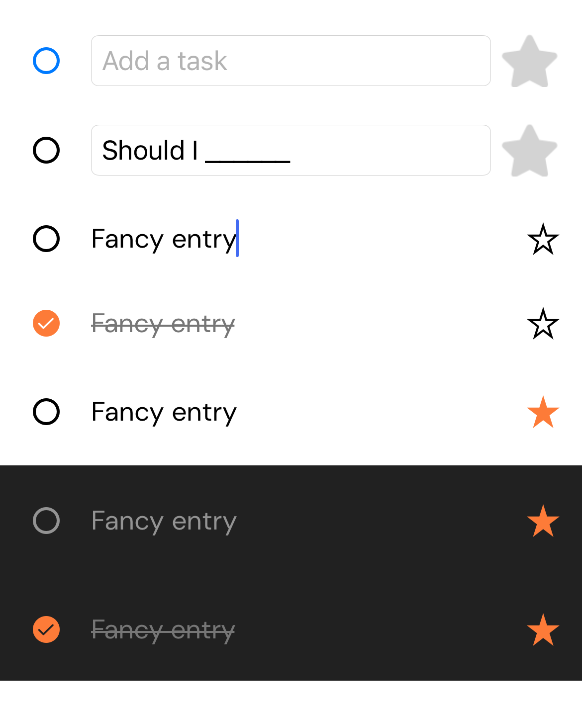

# ToDo Entry

This is a progression exercise building a user control that imitates the behavior from the Microsoft ToDo app.

1. Begin putting the bare controls on a ContentPage
1. Add app theme for colors, fonts, and dark/light.
1. Proceed to style each control using styles, then effects (remove Entry border), and then Visual States.
1. Refactor control to a "user control", a custom class that encapsulates the behavior of the composite experience.
1. Implement the behavior using bindable properties and events.

